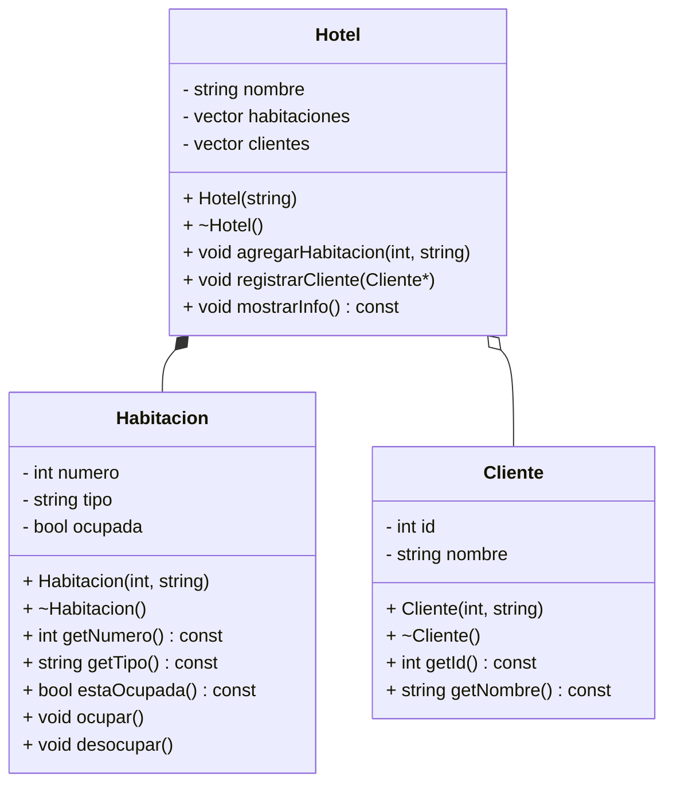

```mermaid 

classDiagram
    class Habitacion {
        - int numero
        - string tipo
        - bool ocupada
        + Habitacion(int, string)
        + ~Habitacion()
        + int getNumero() const
        + string getTipo() const
        + bool estaOcupada() const
        + void ocupar()
        + void desocupar()
    }

    class Cliente {
        - int id
        - string nombre
        + Cliente(int, string)
        + ~Cliente()
        + int getId() const
        + string getNombre() const
    }

    class Hotel {
        - string nombre
        - vector<Habitacion> habitaciones
        - vector<Cliente*> clientes
        + Hotel(string)
        + ~Hotel()
        + void agregarHabitacion(int, string)
        + void registrarCliente(Cliente*)
        + void mostrarInfo() const
    }

    Hotel  *-- Habitacion  
    Hotel  o-- Cliente 

```
